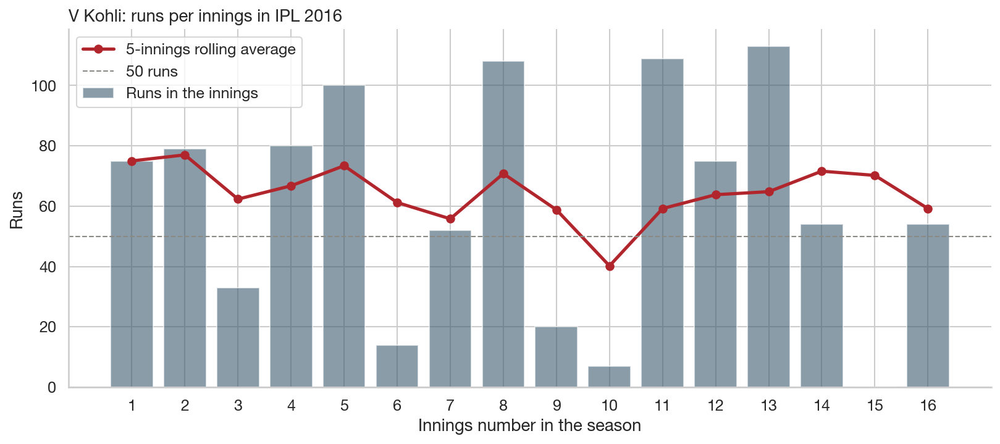
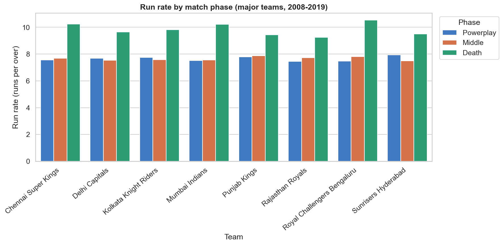
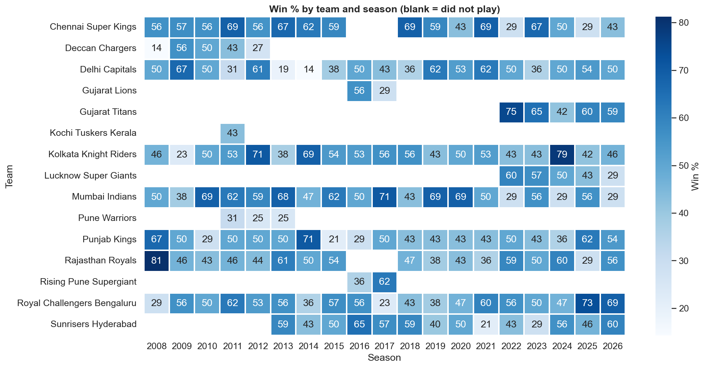
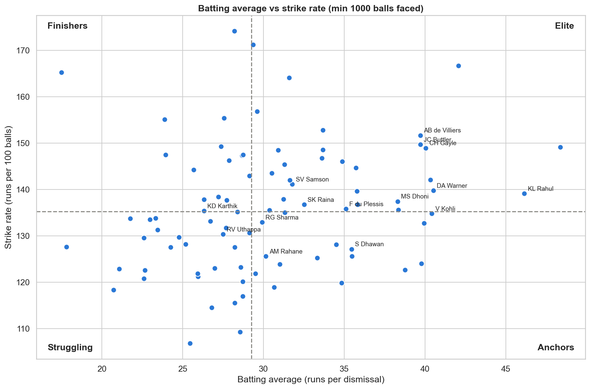
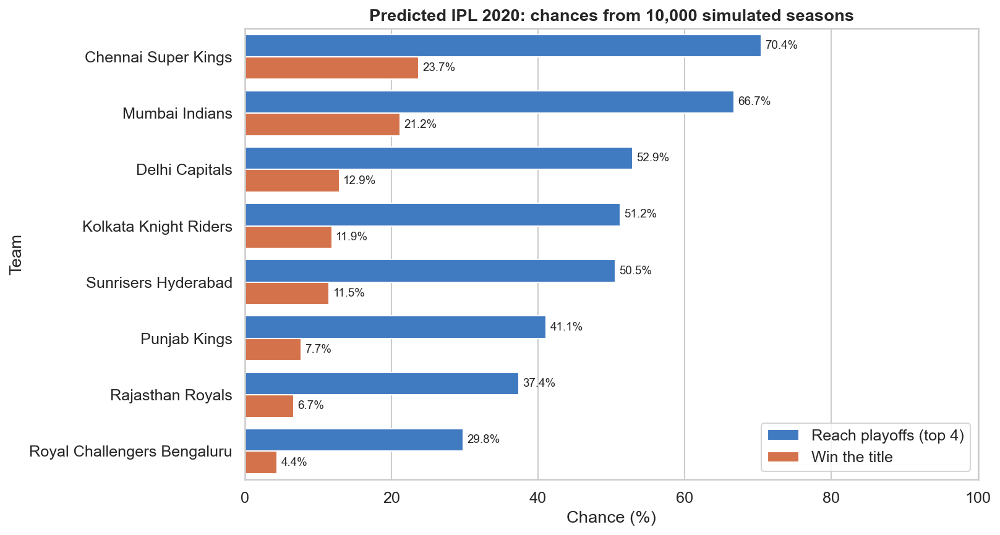
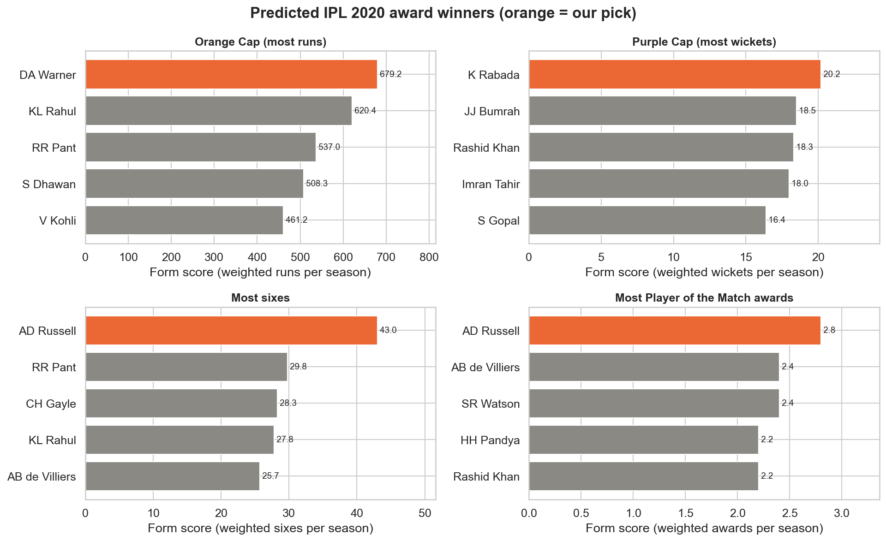

# Sports Arena: IPL Performance Analyzer

[](https://colab.research.google.com/github/Mohanp1821/sports-arena/blob/main/notebooks/ipl_analysis.ipynb)


An open-source data visualisation project that analyses **every ball of the Indian Premier League
from 2008 to 2019** (756 matches, 179,078 deliveries) and turns it into clear charts and an **interactive web dashboard**.

**Course:** Open Source Tools for Data Science (OST), mini project · **Author:** Mohan Pawar

---

## 1. Problem statement

Match results are easy to find, but *why* teams win is not. Does winning the toss help? Is chasing
better than batting first? Which players are in form, and who is best in the Death overs?
These questions need analysis of **every ball**, not just final scores.

## 2. Objectives and scope

1. **Player form:** runs per innings with a 5-innings rolling average, and career trends by season.
2. **Team comparisons:** win %, run rate in each phase (Powerplay / Middle / Death), toss impact, home advantage, head-to-head.
3. **Top performers:** Orange Cap and Purple Cap winners for every season, and top-10 lists.
4. **Predictions:** the likely 2020 champion and award winners (Orange Cap, Purple Cap, Most Sixes,
   Most Player of the Match awards), with a backtest showing how reliable the method is.
5. **Interactive dashboard:** filter every number, chart and table by season and team, click the bars
   to drill down, and search any player's career.

Scope: IPL 2008–2019 (real Kaggle data). Built only with open-source tools: **Python, pandas,
matplotlib, seaborn, plain JavaScript, Git, Docker**.

## 3. Key results

| Finding | Result |
|---|---|
| Chasing vs batting first | Teams batting second won **55.5%** of matches |
| Does the toss matter? | Barely: the toss winner won **52.3%** |
| Fastest scoring phase | Death overs (16–20): **9.8 runs per over**, compared with about 7.6 earlier in the innings |
| Most successful team | Chennai Super Kings: **61.0%** win rate |
| Best season by a batter | Virat Kohli, 2016: **973 runs** |
| Accuracy check | All **24 Orange/Purple Cap winners** and all **12 champions** match the official records |
| Predicted 2020 champion | Chennai Super Kings (**23.7%** chance), then Mumbai Indians (21.2%) |
| Predicted 2020 awards | Orange Cap: **DA Warner** · Purple Cap: **K Rabada** · Most sixes and most Player of the Match: **AD Russell** |

<p align="center">
  
  
  
  
</p>

All 21 charts are in `outputs/`. The full dashboard is `outputs/index.html`.

### The interactive dashboard

Open `outputs/index.html` and click **Explore (interactive)** in the top menu:

| Control | What updates |
|---|---|
| **Season** and **Team** drop-downs | 4 summary cards, the win % bar chart, top 10 run scorers and wicket takers, every match result |
| **Click a bar** in the chart | Selects that team (or that season), so you can drill down |
| **Player search** (type a name) | That player's runs, strike rate, sixes, wickets and economy for every season |

It is plain JavaScript (`src/dashboard_explorer.js`) with the data inside the page, so it needs **no internet
and no extra library**: it works when opened as a file, and when served by Docker.

### How the predictions work

1. **Form score** = weighted average of the last 3 seasons (last season ×3, the one before ×2, then ×1).
2. **Champion:** each team's strength is its form win %. The whole 2020 season (league stage + IPL playoffs)
   is simulated **10,000 times**; in each match team A beats team B with chance A ÷ (A + B).
3. **Awards:** the active player with the best form score (runs, wickets, sixes or Player of the Match awards).
4. **Backtest:** each season 2011–2019 was predicted using only earlier seasons. The favourite won 2 of 9 titles
   (a random pick wins 1 in 8), and the real champion was in our top 5 in 7 of 9 seasons. Individual awards are
   much harder to call, so treat the picks as informed guesses.

<p align="center">
  
  
</p>

## 4. How to run

**Option A: Terminal (one command)**
```bash
./run_all.sh
```
Runs the 6 steps and creates the Python environment automatically the first time.
Then open `outputs/index.html` in a browser.

**Option B: Docker**
```bash
docker compose up --build
```
Then open **http://localhost:8080**. Stop with `Ctrl+C`, then run `docker compose down`.

**Option C: Google Colab** (no installation)
Click the **Open in Colab** badge above, then choose **Runtime → Run all**.

## 5. How it works

```
data/raw/ ──► verify_data.py ──► prepare_data.py ──► analysis.py ──► test_facts.py ──► predict.py ──► build_report.py
 original      checks SHA-256     cleans the data     stats + 19        checks results    2020 champion   dashboard
 CSV files     checksums          data/processed/     charts            vs official       and awards      outputs/index.html
```

| Step | File | What it does |
|---|---|---|
| 1 | `src/verify_data.py` | Proves the raw data is unchanged (SHA-256 checksums) |
| 2 | `src/prepare_data.py` | Fixes team renames, venue spellings, 2 date formats, no-result matches, and **1,245 extras counted twice in 2018–19** |
| 3 | `src/analysis.py` | Draws all charts, using the cricket formulas in `src/metrics.py` |
| 4 | `tests/test_facts.py` | Checks the results against official IPL records (caps, champions, prediction maths) |
| 5 | `src/predict.py` | Predicts the 2020 champion (10,000 simulated seasons) and award winners, and backtests the method |
| 6 | `src/build_report.py` | Builds the interactive web dashboard (filters run in `src/dashboard_explorer.js`) |

**Docker architecture:** two services from one image. `pipeline` runs steps 1–6; `dashboard` serves the
results on port 8080, and starts only if the pipeline succeeded.

## 6. Project structure

```
sports-arena/
├── README.md               ← you are here
├── run_all.sh              run everything with one command
├── git_commands.sh         every Git command used to build this repository, explained
├── Dockerfile              container recipe
├── docker-compose.yml      two-service architecture (pipeline + dashboard)
├── requirements.txt        pinned library versions
├── data/
│   ├── raw/                original dataset (never edited)
│   ├── processed/          cleaned data
│   └── README.md           source, licence, checksums, column guide
├── src/
│   ├── verify_data.py      step 1
│   ├── prepare_data.py     step 2
│   ├── metrics.py          all cricket formulas
│   ├── analysis.py         step 3
│   ├── predict.py          step 5 (predictions)
│   ├── build_report.py     step 6
│   └── dashboard_explorer.js   the dashboard's interactive filters
├── tests/test_facts.py     step 4
├── notebooks/ipl_analysis.ipynb   the same analysis, cell by cell (Colab)
├── outputs/                21 charts, prediction tables (.csv) + index.html dashboard
├── docs/
│   ├── Marking_Scheme.md   each marking criterion → where the evidence is + demo script
│   ├── Code_Explanation.md every file, formula and chart explained simply
│   └── Viva_QA.md          22 likely viva questions with answers
├── CONTRIBUTING.md
└── LICENSE                 MIT (code)
```

## 7. Dataset and licence

**Data:** [Indian Premier League 2008-2019](https://www.kaggle.com/datasets/nowke9/ipldata) by Navaneesh Kumar (Kaggle),
licensed **CC BY-NC-SA 4.0**. Details and checksums are in [`data/README.md`](data/README.md).
**Code:** MIT licence ([`LICENSE`](LICENSE)). The dataset keeps its own licence.

**Limitations:** the data ends in 2019, so predictions cannot see 2020 auctions, injuries or new players; player names are short forms (e.g. `V Kohli`); ball-by-ball totals
can differ from official scorecards by a run (Williamson 2018: 736 here vs 735 official).
