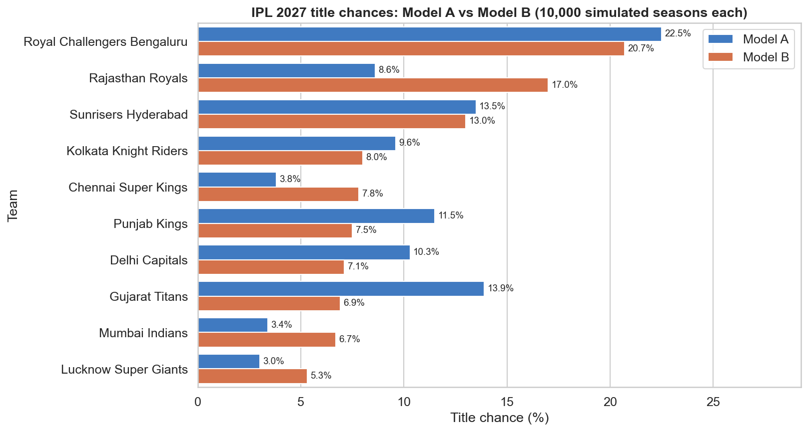
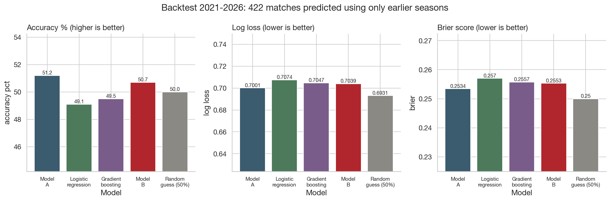
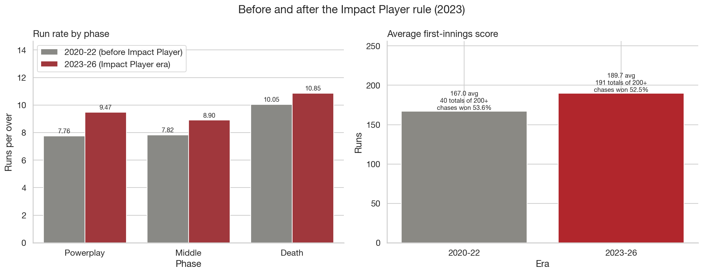
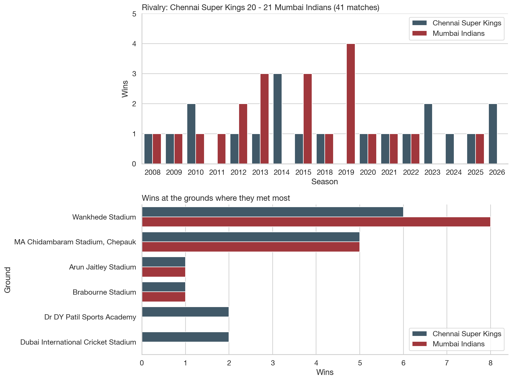

# Sports Arena: IPL Performance Analyzer

[](https://colab.research.google.com/github/Mohanp1821/sports-arena/blob/main/notebooks/ipl_analysis.ipynb)


An open-source analytics project covering **every ball of the Indian Premier League from 2008 to 2026**:
**1,243 matches and 295,729 deliveries across 19 seasons**. It includes analyst-level views for every team,
player and ground, **two 2027 prediction models compared in a backtest**, a **ball-by-ball match centre** and an
**"Ask Sports Arena" chatbot** that answers only from the data. All of it is in a web dashboard that works offline.

**Course:** Open Source Tools for Data Science (OST), mini project · **Author:** Mohan Pawar

---

## 1. Problem statement

Match results are easy to find, but *why* teams win is not. Does the toss matter? Is chasing better? Who wins
the CSK v MI rivalry, and where? Did the Impact Player rule change scoring? Who will win in 2027, and how far can
such a prediction be trusted? Answering these needs **every ball**, cleaned so that names and teams agree across
19 seasons and two data sources.

## 2. Objectives and scope

1. **One clean dataset, 2008-2026:** the Kaggle (2008-2019) and Cricsheet (2020-2026) ball-by-ball data, with one name
   per player, one name per ground and franchise names that run across team renames.
2. **Analyst views:** rivalry centre, batter vs bowler matchups, ground profiles, **pitch and player fit** (how each
   ground plays and how it suits a batter, bowler or fielder), phase and role specialists, the Impact Player era,
   scoring trends, rebuilt points tables, chase win probability and season impact scores.
3. **2027 predictions:** Model A (explainable form model) and Model B (machine learning), each simulating the
   season 10,000 times in the real format, compared in a walk-forward backtest for 2021-2026.
4. **Ask Sports Arena:** a chatbot that answers questions using only the computed facts and names its source.
5. **Reproducible:** checksums, pinned libraries, fixed random seeds, fact-check tests; runs with one command,
   in Docker, or in Google Colab.

Built only with open-source tools: **Python, pandas, matplotlib, seaborn, scikit-learn, plain JavaScript,
Node.js (tests), Git, Docker, and optionally Ollama**.

## 3. Key results

Every number below is calculated by the pipeline (see `outputs/` and the dashboard).

| Finding | Result |
|---|---|
| Accuracy check | All **38 Orange/Purple Caps** (2008-2026) and all **19 champions** match the official records |
| Chasing vs batting first | Teams batting second won **54.5%** of matches |
| Does the toss matter? | Barely: the toss winner won **51.4%** |
| Fastest scoring phase | Death overs (16-20): **10.1 runs per over** |
| Scoring inflation | Average first-innings score **161.9 (2008) → 195.1 (2026)**; sixes per match **10.8 → 19.5** |
| Impact Player era | First-innings average **167.0 (2020-22) → 189.7 (2023-26)**; 200+ totals **0.21 → 0.67 per match** |
| Best all-time win rate | Gujarat Titans **61.0%** (77 matches); Chennai Super Kings 55.8% (265) |
| Strongest home fortress | Sunrisers Hyderabad: home win % **19.7 points** above away |
| How grounds play | Chinnaswamy: **4.7% more runs** than the league in the same seasons; Chepauk **4% fewer** (10.6% fewer fours and sixes) |
| Player fit | V Kohli strikes **+11.4** faster at Chinnaswamy and **−25.7** slower at Chepauk than at other grounds in the same seasons |
| Biggest partnership | AB de Villiers & V Kohli, **229** (2016) |
| **2027 favourite** | **Royal Challengers Bengaluru** in both models: Model A **22.5%**, Model B **20.7%** title chance |
| 2027 award picks | Orange Cap **B Sai Sudharsan** · Purple Cap **B Kumar** · Most sixes **V Suryavanshi** (both models agree) |
| Backtest 2021-2026 (422 matches) | Model A **51.2%** correct, Model B **50.7%**, coin flip 50%; neither beats the coin flip's log loss (0.693) |

**The honest headline:** before a ball is bowled, T20 matches are close to a coin flip. The models are useful for
*explaining* who looks strong and why, not for confident forecasts. Auctions, injuries and breakout players
(V Suryavanshi went from 252 runs in 2025 to 776 in 2026) are not in the data.

<p align="center">
  
  
  
  
</p>

## 4. The site (`outputs/index.html`)

Open it in any browser: everything is inside one page, so it works **offline** as a file. A header on every view has
the menu, **one search box** (players, grounds or teams, including nicknames like "SKY", "Kohli" or "Chepauk") and a
light/dark switch. The address after `#` decides the view, so every page has its own link and Back works:

| Page | Address | What it shows |
|---|---|---|
| **Home** | `#/home` | Headline numbers, the latest champion and caps, the 2027 favourite, top players and grounds |
| **Player page** | `#/player/V Kohli` | Role, teams, 2027 squad, career cards; runs/strike rate and wickets/economy by season (hover charts); last 10 innings (click a bar to open the scorecard); phase splits; toughest and favourite bowlers; record against each team; how he gets out; how each ground suits him |
| **Ground page** | `#/ground/Eden Gardens` | Pitch profile for any period, scores by season, toss and chasing, win % of each team there, top players and best fits, highest totals and recent matches |
| Players / Grounds | `#/players`, `#/grounds` | Directories: top run scorers and wicket takers, 2027 squads; every ground with its runs index |
| Teams, 2027 predictions, Ask, More analysis | `#/teams` … | The sections below, grouped |

Sections inside those views:

| Section | What you can do |
|---|---|
| **Predictions 2027: A vs B** | Title and playoff chances side by side, simulated groups, award picks, backtest, calibration, limits |
| **Ask Sports Arena** | Type a question (e.g. "Kohli vs Bumrah", "Who won the Orange Cap in 2016?") |
| **Explore** | Season and team filters, clickable win % chart, any player's career |
| **Rivalries** | Any two teams: record by season, league vs playoffs, every ground, last 5 meetings, highest/lowest totals, top players |
| **Matchups** | Any batter vs any bowler; a player against each team; how a batter gets out |
| **Grounds** | Any ground: scores by season, chase win %, toss decisions, run rate by phase; a team at that ground; fortress index |
| **Pitch & player fit** | Any ground and period: runs, wickets, boundary and dot-ball indexes vs the league (100 = average), runs by phase, how batters got out; any player's batting, bowling and fielding there vs other grounds in the same seasons; his best and worst grounds (click to switch) |
| **Specialists** | Powerplay / Middle / Death leaders (any season), finishers, partnerships |
| **Impact Player era** | 2020-22 vs 2023-26 and each team's Impact Player choices |
| **Trends** | Scoring inflation, points table of any season (with NRR), chase win-probability calculator, impact scores |
| **Match centre** | `outputs/match_centre.html`: every match ball by ball: scorecard, over-by-over strip, raw rows |

## 5. How the predictions work

**Model A (explainable, `src/predict.py`)**
1. Strength = **form win %**: the last 3 seasons weighted 3, 2, 1.
2. Team A beats team B with chance **A ÷ (A + B)**.
3. The 2027 season is played **10,000 times** in the real 10-team format: two groups of 5 (seeded by titles), each team
   plays its group twice, the other group once and one "row-mate" a second time (14 games), then Qualifier 1,
   Eliminator, Qualifier 2 and the Final.
4. Awards = the 2027-squad player with the best form score.

**Model B (machine learning, `src/predict_ml.py`)**
1. Pre-season features only: **Elo rating, last-10 form, head-to-head (3 seasons), ground record, home flag,
   squad strength** (best 11 previous-season impact scores in the squad) and an **Impact Player era** flag.
   No toss (unknown before the season).
2. **Logistic regression** and **gradient boosting** (scikit-learn), averaged; each match is used both ways round so
   both teams are treated fairly.
3. The match chances go into the same 10,000-season simulator.
4. Awards = a linear regression on each player's previous two seasons.

**Squads:** `data/squads_2027.csv` starts as each franchise's 2026 players. Edit it after trades and the auction,
then run the pipeline again; both models read it.

**Comparison:** a walk-forward backtest for 2021-2026 (each season predicted using only earlier seasons) reports
accuracy, log loss, Brier score and calibration for matches, where the real champion ranked, and award ranks,
against a random baseline (50% per match; 1 in 8, then 1 in 10, for the title).

## 6. How the chatbot works

* **Offline (default):** `src/chatbot.js` runs inside the page. It finds teams, players, grounds, seasons and dates in
  the question (with aliases such as "SKY", "CSK", "Chepauk", "Kings XI Punjab"; e.g. "How does the pitch at Chepauk
  play?" or "Kohli at Chinnaswamy"), works out the question type and builds
  the answer **only** from `outputs/chat_facts.json` (made by `src/chat_facts.py`). Every answer says where its numbers
  come from. Out-of-scope questions get a polite "I can only answer…" with suggestions; ambiguous names ("Sharma")
  get a "which one?".
* **Optional local LLM:** `src/chat_server.py` retrieves the matching fact lines and asks an open-weights model through
  **Ollama** to answer only from them. Start it with `docker compose --profile llm up`; the page uses it when it
  is running and falls back to offline mode otherwise. (The retrieval and server were tested; the Ollama call
  itself needs Ollama and a pulled model.)
* **Tests:** `tests/test_chatbot.js` checks 24 questions (e.g. "Who won the Orange Cap in 2016?" must say V Kohli and 973).

## 7. How to run

**Option A: Terminal (one command)**
```bash
./run_all.sh
```
Creates the Python environment the first time, runs the 8 steps, and finishes with the dashboard in `outputs/`.
Node.js is needed only for step 8 (the chatbot checks); without it that step is skipped with a message.

**Option B: Docker**
```bash
colima start                 # Mac only, once after every restart (starts the Docker engine)
docker compose up --build
```
Then open **http://localhost:8080**. Stop with `Ctrl+C`, then `docker compose down`.
Tested: the container passes every check and produces the same data, CSV and HTML files as a local run (chart PNGs differ by
a few pixels between Linux and macOS because of fonts). If another copy of the project is already running, its fixed
container names (`sports-arena-pipeline`, `sports-arena-dashboard`) clash: run `docker compose down` in that copy first.
Optional chatbot model: `docker compose --profile llm up --build`, then (first time only)
`docker compose --profile llm exec ollama ollama pull llama3.2:3b`.

**Option C: Google Colab** (no installation)
Click the **Open in Colab** badge above, then **Runtime → Run all**.

## 8. How it works

```
data/merged/ ─► verify_data ─► prepare_data ─► analysis ─► test_facts ─► predict ─► predict_ml ─► build_report ─► test_chatbot
 never edited   SHA-256        franchises,     37 charts    official      Model A     Model B +      dashboard,       24 chatbot
                checksums      venues, names                records       2027        backtest       match centre,    questions
                               → processed/                                                          chat facts
```

| Step | File | What it does |
|---|---|---|
| 1 | `src/verify_data.py` | Proves the data files are unchanged (SHA-256 checksums) |
| 2 | `src/prepare_data.py` | Franchise column, one name and city per ground, the player-name map, match stage and phase |
| 3 | `src/analysis.py` | Draws all charts, using the cricket formulas in `src/metrics.py` |
| 4 | `tests/test_facts.py` | Checks results against official records and checks the analyst views and models |
| 5 | `src/predict.py` | Model A for 2027, the season simulator, and Model A's backtest |
| 6 | `src/predict_ml.py` | Model B for 2027 and the Model A vs Model B comparison |
| 7 | `src/build_report.py` | Builds `outputs/index.html`, `outputs/match_centre.html` and `outputs/chat_facts.json` |
| 8 | `tests/test_chatbot.js`, `tests/test_site.js` | Runs 24 questions through the chatbot; checks the site's router, search, career numbers and charts |

One-off data scripts (already run; their outputs are committed): `src/recover_merged_data.py`,
`src/build_name_map.py` and `src/build_impact_players.py` (see `data/README.md`).

## 9. Project structure

```
sports-arena/
├── README.md                ← you are here
├── run_all.sh               run everything with one command
├── Dockerfile, docker-compose.yml   pipeline + dashboard (+ optional Ollama chat profile)
├── requirements.txt         pinned library versions
├── data/
│   ├── merged/              deliveries_2008_2026.csv, matches_2008_2026.csv (single source of truth, never edited)
│   ├── source/              the explorer page the merged files were recovered from
│   ├── raw/                 the original Kaggle 2008-2019 files (reference)
│   ├── player_name_map.csv  71 player-name fixes
│   ├── impact_players_2020_2026.csv   557 Impact Player substitutions
│   ├── squads_2027.csv      2027 squads (edit after the auction)
│   ├── processed/           analysis-ready data
│   └── README.md            sources, licences, build scripts, rules and checksums
├── src/
│   ├── verify_data.py, prepare_data.py, metrics.py, analysis.py
│   ├── predict.py, predict_ml.py               the two models
│   ├── dashboard_data.py, build_report.py      the dashboard
│   ├── site.js                                 the new design: router, search, Home, player and ground pages
│   ├── dashboard_explorer.js, dashboard_analytics.js, match_centre.py, match_centre.js
│   ├── chat_facts.py, chatbot.js, chat_server.py    the chatbot
│   └── recover_merged_data.py, build_name_map.py, build_impact_players.py   one-off data scripts
├── tests/test_facts.py, tests/test_chatbot.js, tests/test_site.js
├── notebooks/ipl_analysis.ipynb   the analysis in Colab
├── outputs/                 charts, prediction and backtest CSVs, index.html, match_centre.html, chat_facts.json
├── docs/                    Code_Explanation.md, Marking_Scheme.md, Viva_QA.md
├── CONTRIBUTING.md
└── LICENSE                  MIT (code)
```

## 10. Data and licences

* **2008-2019:** [Indian Premier League 2008-2019](https://www.kaggle.com/datasets/nowke9/ipldata) by Navaneesh Kumar
  (Kaggle), **CC BY-NC-SA 4.0** (non-commercial, credit, share alike).
* **2020-2026:** ball-by-ball data from **[Cricsheet](https://cricsheet.org)** (JSON data version 1.2.0). Thank you to
  Cricsheet. Its player register is published under the **Open Data Commons Attribution License (ODC-By 1.0)**.
* **Code:** MIT ([`LICENSE`](LICENSE)). The data keeps its own licences. Details, checksums and every cleaning rule
  are in [`data/README.md`](data/README.md).

**Limitations:** there are no pitch reports or ball-tracking in the data, so "how a pitch plays" is measured from the
results at each ground (it mixes pitch, boundary size, outfield and weather); fielding only counts catches, run outs and
stumpings (no drops or runs saved); pre-season predictions are close to a coin flip; a 2008 match abandoned without a ball is not in the
data (so Delhi's rebuilt 2008 points are one below official); rain-shortened matches use the overs actually bowled
for net run rate; pace vs spin splits are not included because the data has no bowling styles.
